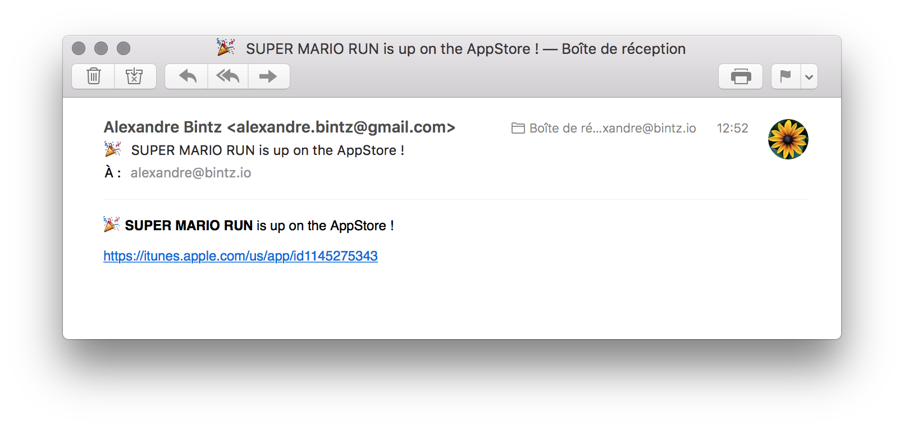
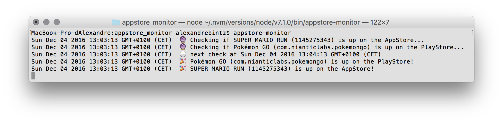
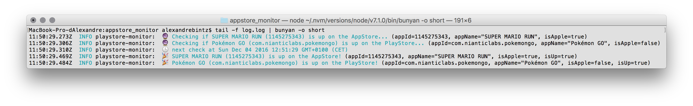

# appstore-monitor
Get notified when your app is up on the AppStore/PlayStore ! 🚀


## Install

Install with npm

```
$ npm i -g https://github.com/alexbinary/appstore-monitor.git
```


## Usage

Create your config file from [the sample](sample.conf.cson) :

```coffeescript
# conf.cson
apps:
  'com.nianticlabs.pokemongo':  # Use package name for Android apps
    name: 'Pokémon GO'
  '1145275343':                 # Use app id for iOS apps
    name: 'SUPER MARIO RUN'
  # watch as many apps as you like
  # ...
smtp: # SMTP server to use to send mail
  host: 'smtp.domain.com'
  user: 'username@domain.com'
  password: 'secret'
email: # people listed here will get an email when an app is up
  to: ['name1 <username1@domain1.com>']
```

Start monitoring :

```
$ appstore-monitor -c /path/to/conf.cson
```

When any of the app will become up on the store, you'll get a stylish and joyful email with the link :




## Logging

Loggig is performed using [bunyan](https://github.com/trentm/node-bunyan).
You get pretty logs in the console, and logs are also written to disk.



You can set the path to the logfile with the `-l` flag :
```
$ appstore-monitor -l /path/to/logfile
```

To read the log you need to use bunyan.

Install bunyan :
```
$ npm i -g bunyan
```
Read the log :
```
$ tail -f /path/to/logfile | bunyan -o short
```



See `bunyan -h` for available options.


## The status file

The result of the last check of each app is written in a status file.
This is needed to know when to stop checking an app that is already up on the store,
and thus send an email only once.

The default location is `./status.cson` but you can change it with the `-s` flag :
```
$ appstore-monitor -s /path/to/statusfile
```
